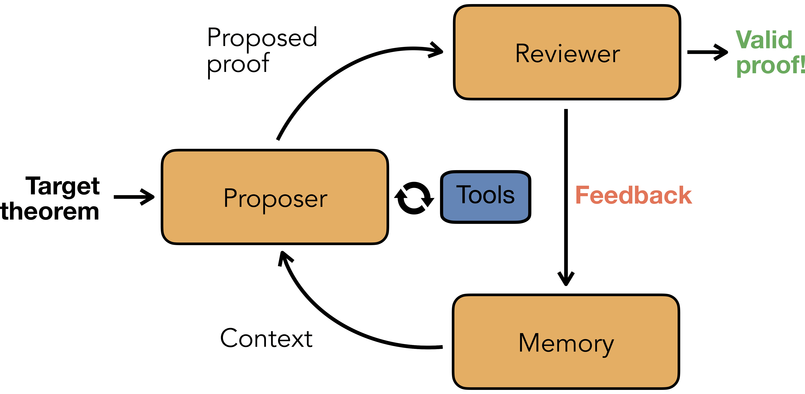

# ax-prover

**A minimal agent for automated theorem proving in Lean 4**

[](https://github.com/Axiomatic-AI/ax-prover-base/actions/workflows/unit_tests.yml)
[](https://www.python.org/downloads/)
[](LICENSE)
[](https://pypi.org/project/ax-prover/)

A simple, modular agent that proves Lean 4 theorems through iterative refinement.
It uses off-the-shelf LLMs (no fine-tuning) with a feedback loop, a memory system, and library search tools to achieve competitive results against highly-engineered systems that rely on specialized training and orders of magnitude more compute.

## Key Results

| Benchmark | AxProverBase | Best Comparable |
|-----------|----------|-----------------|
| **PutnamBench** | **54.7%** (pass@1) | 13.0% (Goedel V2, pass@184) |
| **FATE-M** | **98.0%** | 62.7% (DeepSeek V2, pass@64) |
| **FATE-H** | **66.0%** | 3.0% (DeepSeek V2) |
| **FATE-X** | **24.0%** | 0.0% (all others) |
| **LeanCat** | **59.0%** | 14.0% (Gemini 3 Pro) |

All results with Claude Opus 4.5, 50 iterations, pass@1. See our [paper](#citation) for full details and comparisons.

## How It Works

<p align="center">
  
</p>

The agent runs an iterative loop:

1. **Proposer** — An LLM writes Lean 4 proof code, optionally using tools (LeanSearch, web search) to find relevant Mathlib lemmas
2. **Compiler** — Builds the code with `lake`; extracts goal states at `sorry` locations to provide structured feedback
3. **Reviewer** — Verifies statement preservation and proof validity (no `sorry`, no cheating tactics)
4. **Memory** — Summarizes lessons from failed attempts into a concise "lab notebook" to prevent repeating mistakes

The loop continues until the proof is complete or the iteration budget is exhausted (default: 50).

## Quick Start

```bash
pip install ax-prover
```

```bash
# Configure your API keys
ax-prover configure

# Navigate to a Lean 4 project
cd /path/to/lean4-project

# Prove a theorem
ax-prover prove MyModule:my_theorem
```

## Installation

```bash
pip install ax-prover
# or
uv add ax-prover

# For development (includes ruff, pytest, pre-commit)
pip install -e ".[dev]"
```

<details>
<summary><strong>Prerequisites</strong></summary>

- **Python 3.11+**
- **Lean 4** with `lake` available on PATH ([installation guide](https://leanprover-community.github.io/get_started.html))
- **LLM API key** — at least one of:
  - `ANTHROPIC_API_KEY` (recommended — Claude Opus 4.5 gives best results)
  - `OPENAI_API_KEY`
  - `GOOGLE_API_KEY`
- **Tavily API key** (optional, for web search) — `TAVILY_API_KEY`

Set up your API keys interactively:

```bash
ax-prover configure
```

Or export them directly in your shell:

```bash
export ANTHROPIC_API_KEY=sk-ant-...
```

</details>

## Usage

### Proving theorems

```bash
# Prove a specific theorem by module path
ax-prover prove MyModule.Path:theorem_name

# Prove a specific theorem by file path
ax-prover prove MyProject/Algebra/Ring.lean:theorem_name

# Prove the theorem at a specific line
ax-prover prove MyProject/Algebra/Ring.lean#L42

# Prove all unproven theorems in a file
ax-prover prove MyProject/Algebra/Ring.lean

# Skip lake build (if repo is already built)
ax-prover prove MyModule:theorem_name --skip-build

# Save JSON output to file (for scripting/automation)
ax-prover prove MyModule:theorem_name -o result.json
```

### Running experiments

Run batch evaluations on [LangSmith](https://smith.langchain.com) datasets:

```bash
# Run experiment on a dataset
ax-prover experiment dataset_name

# With custom concurrency
ax-prover experiment dataset_name --max-concurrency 8
```

<details>
<summary><strong>Configuration</strong></summary>

Customize behavior with YAML config files and CLI overrides:

```yaml
# my_config.yaml
prover:
  max_iterations: 75
  prover_llm:
    model: "anthropic:claude-opus-4-20250514"
    temperature: 0.5
    thinking:
      type: enabled
      budget_tokens: 32000
```

```bash
# Use a config file
ax-prover --config my_config.yaml prove MyModule:theorem

# Override values from the CLI
ax-prover prove MyModule:theorem prover.max_iterations=100

# Save your current configuration for later reuse
ax-prover --save-config my_setup prove MyModule:theorem
```

</details>

## Contributing

We welcome contributions of all kinds — bug reports, feature requests, documentation, and code.
See our [Contributing Guide](CONTRIBUTING.md) to get started.

## License

This project is licensed under the [AGPL-3.0](LICENSE).

## Citation

If you use ax-prover in your research, please cite:

```bibtex
@article{axproverbase2026,
  title={A Minimal Agent for Automated Theorem Proving},
  author={Requena Pozo, Borja and Letson, Austin and Nowakowski, Krystian and Beltran Ferreiro, Izan and Sarra, Leopoldo},
  year={2026}
}
```
