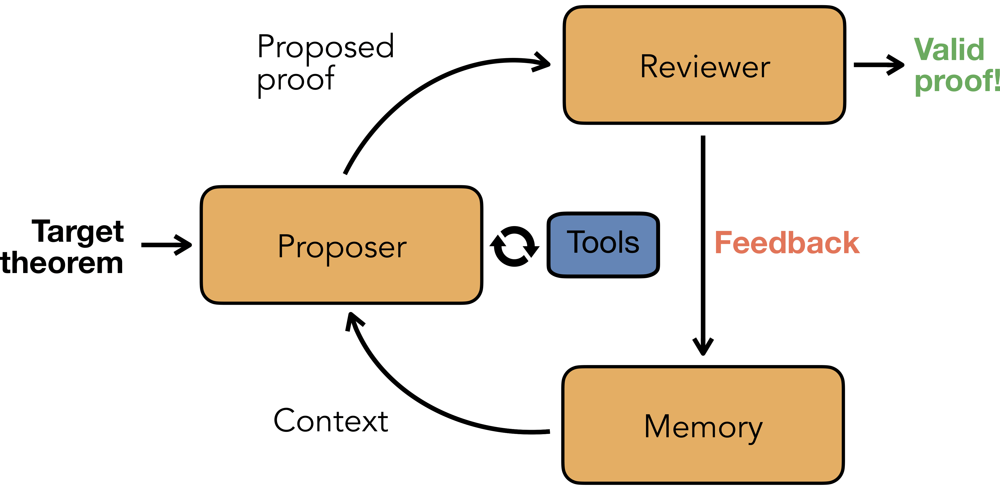

# ax-prover

**A minimal agent for automated theorem proving in Lean 4**

[](https://github.com/Axiomatic-AI/ax-prover-base/actions/workflows/unit_tests.yml)
[](https://www.python.org/downloads/)
[](LICENSE)
[](https://pypi.org/project/ax-prover/)
[](https://arxiv.org/abs/2602.24273)

A simple, modular agent that proves Lean 4 theorems through iterative refinement.
It uses off-the-shelf LLMs (no fine-tuning) with a feedback loop, a memory system, and library search tools to achieve competitive results against highly-engineered systems that rely on specialized training and orders of magnitude more compute.

## Key Results

| Benchmark | AxProverBase | Best Comparable |
|-----------|----------|-----------------|
| **PutnamBench** | **54.7%** (pass@1) | 13.0% (Goedel V2, pass@184) |
| **FATE-M** | **98.0%** | 62.7% (DeepSeek V2, pass@64) |
| **FATE-H** | **66.0%** | 3.0% (DeepSeek V2) |
| **FATE-X** | **24.0%** | 0.0% (all others) |
| **LeanCat** | **59.0%** | 14.0% (Gemini 3 Pro) |

All results with Claude Opus 4.5, 50 iterations, pass@1. See our [paper](#citation) for full details and comparisons.

## How It Works

<p align="center">
  
</p>

The agent runs an iterative loop:

1. **Proposer** — An LLM writes Lean 4 proof code, optionally using tools (LeanSearch, web search) to find relevant Mathlib lemmas
2. **Compiler** — Builds the code with `lake`; extracts goal states at `sorry` locations to provide structured feedback
3. **Reviewer** — Verifies statement preservation and proof validity (no `sorry`, no cheating tactics)
4. **Memory** — Summarizes lessons from failed attempts into a concise "lab notebook" to prevent repeating mistakes

The loop continues until the proof is complete or the iteration budget is exhausted (default: 50).

### Blueprint mode

`--blueprint` selects a second, additive proving mode that decomposes a hard target into a
DAG of helper lemmas instead of attacking it directly. The direct prover above is the
default and is unchanged.

1. **Architect** — writes a compiling Lean skeleton of `sorry`ed helper lemmas, each
   carrying its graph identity in an `ax-blueprint` docstring block. Its only tool is
   `lean_compile`.
2. **Canonicalization** — the skeleton is compiled and its declarations extracted, so the
   graph is derived from what Lean actually elaborated, never from parsing a model response.
3. **Frontier scheduling** — nodes whose declared parents are already solved are proven
   concurrently. Each node prover sees one statement, its direct parents' signatures, and
   the file's trusted context; it returns a proof body and nothing else. Candidate proofs
   compile against one warm Lean server for the whole run (~0.06s per attempt on a Mathlib
   project, versus a ~39s median for a fresh `lake env lean`), and a node counts as solved
   only if it also passes an axiom check.
4. **Refinement** — failed nodes are diagnosed as `PROOF_TOO_HARD` or `STATEMENT_WRONG`, and
   a refiner revises the graph. Proofs whose interface fingerprint is unchanged are reused.
5. **Assembly** — helpers are rendered in topological order inside a deterministic unique
   namespace immediately before the target, the whole file is compiled, and
   [Comparator](https://github.com/leanprover/comparator) judges the result.

The user's source file is read once at run start and written exactly once at the end, only
after every check passes. Failed, cancelled, and interrupted runs change it zero times.

## Quick Start

```bash
pip install ax-prover
```

```bash
# Configure your API keys
ax-prover configure

# Navigate to a Lean 4 project
cd /path/to/lean4-project

# Prove a theorem
ax-prover prove MyModule:my_theorem
```

## Installation

```bash
pip install ax-prover
# or
uv add ax-prover

# For development (includes ruff, pytest, pre-commit)
pip install -e ".[dev]"
```

<details>
<summary><strong>Prerequisites</strong></summary>

- **Python 3.11+**
- **Lean 4** with `lake` available on PATH ([installation guide](https://leanprover-community.github.io/get_started.html))
- **LLM API key** — at least one of:
  - `ANTHROPIC_API_KEY` (recommended — Claude Opus 4.5 gives best results)
  - `OPENAI_API_KEY`
  - `GOOGLE_API_KEY`
- **Tavily API key** (optional, for web search) — `TAVILY_API_KEY`

Set up your API keys interactively:

```bash
ax-prover configure
```

Or export them directly in your shell:

```bash
export ANTHROPIC_API_KEY=sk-ant-...
```

</details>

## Usage

### Proving theorems

```bash
# Prove a specific theorem by module path
ax-prover prove MyModule.Path:theorem_name

# Prove a specific theorem by file path
ax-prover prove MyProject/Algebra/Ring.lean:theorem_name

# Prove the theorem at a specific line
ax-prover prove MyProject/Algebra/Ring.lean#L42

# Prove all unproven theorems in a file
ax-prover prove MyProject/Algebra/Ring.lean

# Skip lake build (if repo is already built)
ax-prover prove MyModule:theorem_name --skip-build

# Save JSON output to file (for scripting/automation)
ax-prover prove MyModule:theorem_name -o result.json
```

### Blueprint mode

```bash
# Decompose the target into helper lemmas, then prove them bottom-up
ax-prover --config blueprint.yaml prove MyModule:theorem_name --blueprint

# Resume an interrupted run, reusing every proof whose interface is unchanged
ax-prover --config blueprint.yaml prove MyModule:theorem_name --blueprint --resume

# Discard the checkpoint and start over
ax-prover --config blueprint.yaml prove MyModule:theorem_name --blueprint --restart

# Tune the budgets for one run
ax-prover --config blueprint.yaml prove MyModule:theorem_name --blueprint \
    --max-refinements 16 --max-node-agents 8
```

Model-side and Lean-side concurrency are separate. `--max-node-agents` controls how many
node agents reason and search at once; `--max-lean-compiles` (default 1) controls how many
Lean compilations run at once. Each concurrent Mathlib environment needs roughly 2GB
resident, so raise the latter only on a machine with memory to spare.

The bundled `blueprint.yaml` runs all three roles on DeepSeek through OpenRouter, which
needs `OPENROUTER_API_KEY`. Each role is configured independently, so you can pair an
expensive architect with a cheap node prover:

```yaml
blueprint:
  architect:
    llm: ${llm_configs.claude_opus_4_5}
```

Results are reported as `solved`, `failed`, `infrastructure_error`, or
`comparator_pending`. Comparator needs Linux plus `landrun` and `lean4export` on `PATH`; on
other platforms a run that passes the full Lean build reports `comparator_pending` and
Linux CI remains the authoritative gate. Pass `--require-comparator` to fail instead.

### Running experiments

Run batch evaluations on [LangSmith](https://smith.langchain.com) datasets:

```bash
# Run experiment on a dataset
ax-prover experiment dataset_name

# With custom concurrency
ax-prover experiment dataset_name --max-concurrency 8

# Blueprint mode, with graph and refinement metrics as evaluators
ax-prover --config blueprint.yaml experiment putnam_solutions_tiny --max-concurrency 4
```

<details>
<summary><strong>Configuration</strong></summary>

Customize behavior with YAML config files and CLI overrides:

```yaml
# my_config.yaml
prover:
  max_iterations: 75
  prover_llm:
    model: "anthropic:claude-opus-4-20250514"
    temperature: 0.5
    thinking:
      type: enabled
      budget_tokens: 32000
```

```bash
# Use a config file
ax-prover --config my_config.yaml prove MyModule:theorem

# Override values from the CLI
ax-prover prove MyModule:theorem prover.max_iterations=100

# Save your current configuration for later reuse
ax-prover --save-config my_setup prove MyModule:theorem
```

</details>

## Contributing

We welcome contributions of all kinds — bug reports, feature requests, documentation, and code.
See our [Contributing Guide](CONTRIBUTING.md) to get started.

## License

This project is licensed under the [AGPL-3.0](LICENSE).

## Citation

If you use ax-prover in your research, please cite:

```bibtex
@article{axproverbase2026,
  title={A Minimal Agent for Automated Theorem Proving},
  author={Requena Pozo, Borja and Letson, Austin and Nowakowski, Krystian and Beltran Ferreiro, Izan and Sarra, Leopoldo},
  year={2026},
  eprint={2602.24273},
  archivePrefix={arXiv},
  url={https://arxiv.org/abs/2602.24273}
}
```
